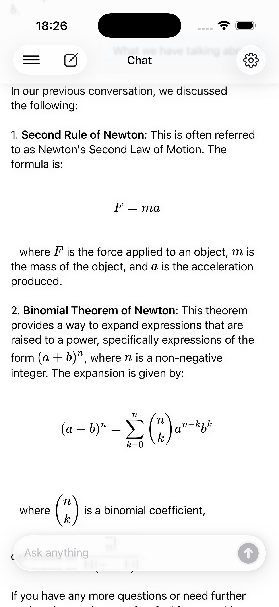
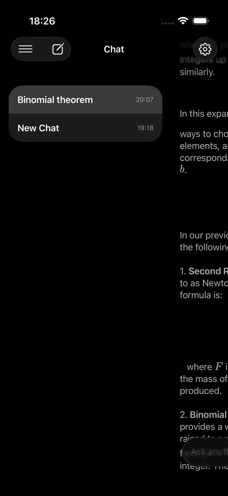

# LocalMind

A SwiftUI app that allows you to chat with Apple Intelligence using the new [Foundation Models Framework](https://developer.apple.com/documentation/foundationmodels) and Liquid Glass UI on iOS 26+, built with The Composable Architecture (TCA).

 
 
 


## 📱 Screenshots

<div align="center">
  
  
  
</div>

## Features

- **Offline AI Chat**: Chat with the Apple Intelligence model directly on device using Swift 6.0 async/await
- **Streaming Responses**: Real-time streaming text generation with haptic feedback
- **Modern Glass UI**: Liquid Glass UI design with interactive glass effects
- **TCA Architecture**: Built with The Composable Architecture for predictable state management
- **Mathematical Formula Support**: LaTeX rendering for complex mathematical expressions
- **Persistent Conversations**: SQLite data storage for message history and discussions
- **Customizable Settings**: Adjust temperature, system instructions, and streaming preferences
- **Multi-Platform Support**: Native iOS, iPadOS, and macOS experiences

## Architecture

LocalMind is built using **The Composable Architecture (TCA)** with Swift 6.0's enhanced concurrency features

## Technical Highlights

### Swift 6.0 Async/Await
- Full adoption of Swift 6.0's strict concurrency checking
- Structured concurrency for reliable async operations
- Async streams for real-time message streaming

### The Composable Architecture (TCA)
- Predictable state management
- Testable business logic
- Modular feature composition
- Side effect management

### LaTeX Formula Decoding
- Render mathematical expressions using LaTeX
- Support for complex equations and scientific notation
- Seamless integration with chat messages

### SQLite Data Persistence
```swift
// Async database operations
@Dependency(\.databaseClient) var databaseClient

func createSession(_ session: ChatSession) async throws {
    try await databaseClient.createSession(session)
}

func fetchAllSessions() async throws -> [ChatSession] {
    try await databaseClient.fetchAllSessions()
}
```

## Requirements

- iOS/iPadOS/macOS 26.0+
- Device with Apple Intelligence support
- Xcode 26.0 beta or newer
- Swift 6.0

## Installation

1. Clone the repository:

```bash
git clone https://github.com/karkadi/LocalMind.git
```

2. Open the project in Xcode:

```bash
cd LocalMind
open LocalMind.xcodeproj
```

3. Select a development team, then run on a compatible device or simulator

4. Install dependencies (if using Swift Package Manager):

The project includes dependencies for TCA, SQLite, and LaTeX rendering which will be automatically resolved by Xcode.

## Project Structure

```
LocalMind/
├── Sources/
│   ├── App/                           # App entry point and configuration
│   ├── Core/                          # Core application components
│   │   ├── Models/                    # Data models and entities
│   │   ├── Services/                  # Business logic services
│   │   │   ├── ChatClient.swift       # AI chat functionality
│   │   │   ├── DatabaseClient.swift   # SQLite persistence
│   │   │   └── DeviceInfoClient.swift # Device Info
│   │   └── Utils/                     # Utilities and helpers
│   ├── Features/                      # Feature modules
│   │   ├── Root/                      # Root feature coordinator
│   │   ├── Chat/                      # Main chat interface
│   │   │   ├── Settings/              # Chat settings and preferences
│   │   │   └── Views/                 # Chat-specific UI components
│   │   └── SideBar/                   # Navigation sidebar
│   │       └── RenameDialog/          # Conversation management
│   │   
│   └── Resources/
│       └── Assets.xcassets/
│           ├── AccentColor.colorset
│           └── AppIcon.appiconset
│
└── Tests/                             # Unit and integration tests
     ├── LocalMindTests
     └── LocalMindUITests 
```

### Directory Overview

- **App**: Application lifecycle and main app structure
- **Core**: Foundation layer containing models, services, and utilities
- **Features**: Feature modules following TCA principles, each with:
  - Reducer (state management)
  - View (SwiftUI presentation)
  - Dependencies (service integration)
- **SharedUI**: Cross-platform UI components and modifiers
- **Resources**: Assets, colors, and app icons

## Usage

1. **First Launch**: Ensure Apple Intelligence is enabled in System Settings
2. **Start Chatting**: Launch the app - conversations are automatically persisted in SQLite
3. **Mathematical Expressions**: Use LaTeX syntax for formulas: `$E = mc^2$` or `$$\int_a^b f(x)dx$$`
4. **Customize Experience**: Access Settings to:
   - Toggle streaming responses with haptic feedback
   - Adjust temperature (0.0 - 2.0) for response creativity
   - Modify system instructions and behavior
   - Manage conversation history
   - Clear cached data

## Database Schema

LocalMind uses SQLite with Swift 6.0 async/await for:
- Message history with timestamps and conversation context
- Conversation metadata and organization
- User preferences and app settings
- Cached LaTeX renderings for performance

## TODO / Roadmap

  - [ ] Adding Unit Tests**
  - [ ] Export conversations as PDF with LaTeX support
  - [ ] Search through conversation history
  - [ ] Conversation folders and organization
  - [ ] Voice input and output
  - [ ] Image analysis and discussion
  - [ ] Code syntax highlighting
  - [ ] iCloud sync across devices
  - [ ] Siri shortcuts integration
  
## License

This project is available under the [MIT License](LICENSE).

## Contributing

Contributions are welcome! Please feel free to submit a Pull Request. When contributing, ensure:

## Acknowledgments

LocalMind is built upon several excellent open-source projects and frameworks:

### Core Dependencies
- **[Swift Composable Architecture](https://swiftpackageindex.com/pointfreeco/swift-composable-architecture)** - The foundational architecture pattern that enables predictable state management and testable business logic
- **[LaTeXSwiftUI](https://swiftpackageindex.com/colinc86/LaTeXSwiftUI)** - Powerful LaTeX rendering capabilities that bring mathematical expressions to life in our chat interface
- **[SQLite Data](https://swiftpackageindex.com/pointfreeco/sqlite-data)** - Robust SQLite integration with Swift 6.0 async/await support for reliable data persistence

### Apple Frameworks
- **Foundation Models Framework** - Apple's on-device AI capabilities that power our chat experience
- **SwiftUI** - Modern declarative UI framework with Liquid Glass design system
- **Swift 6.0** - Next-generation Swift with advanced concurrency features

### Inspiration
- The open-source community for continuous innovation in Swift development
- Apple's Human Interface Guidelines for creating intuitive multi-platform experiences

We extend our gratitude to the maintainers and contributors of these projects for their excellent work that makes LocalMind possible.

---

Built with ❤️ using Swift 6.0, TCA, and Apple's latest technologies.
